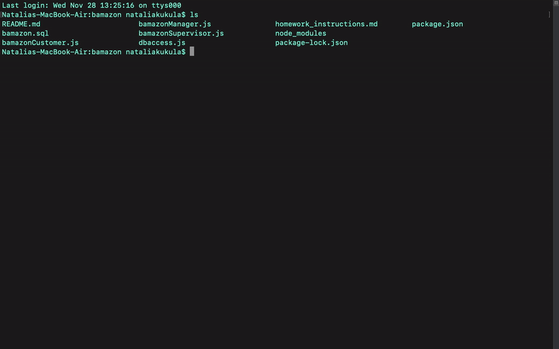
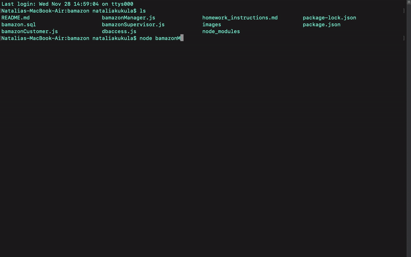
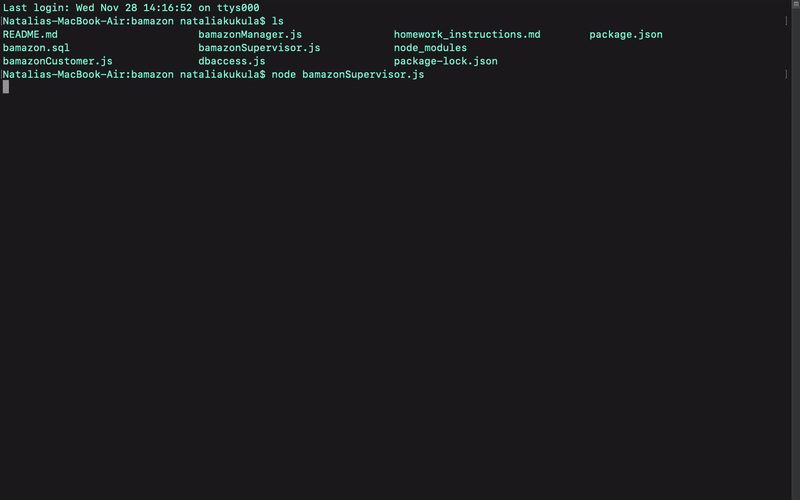

# Bamazon
**Name:** CLI-Bamazon \
**Created for:** Northwestern Coding Bootcamp \
**Developer:** Natalia Kukula \
**Deployment Date:**  November 28, 2018 \
**Runtime:** Node.js\
**Command Line:** Git Bash\
**Built with:** Javascript, mySQL\
**Npm:** dotenv, inquirer, mysql, table

## Summary
Bamazon is a storefront CLI app that utilizes MySQL to store information in a database in the node.js environment.

Bamazon operates in 3 files and gives access to the Customer, Manager and Supervisor to store's inventory.

&nbsp;

### 1. Bamazon Customer

| Customer View | `node bamazonCustomer.js` |
| --- | --- |
| _Products Table_ | Customer views all available products accessed from the database. |
| _Product ID Prompt_ | Customer chooses product by id. |
| _Item Amount Prompt_ | Customer decides on the number of products to buy. The database will be updated and the stock quantity of product will be decreased.|
| _Total Cost Display_ | The total cost of the product gets displayed and the product sales column will be updated in the database. |

&nbsp;

### 2. Bamazon Manager

| Manager View | `node bamazonManager.js` |
| --- | --- |
| _View Products for Sale_ | Manager views all available products accessed from the database. |
| _View Low Inventory_ | Manager views all products with stock quantity below 5. |
| _Add to Inventory_ | Manager chooses a product from the menu and adds stock quantity which gets saved in the database.|
| _Add New Product_ | Manager chooses a department from the menu and adds a product (name, price and quantity) which gets added to the database. |

&nbsp;

### 2. Bamazon Supervisor

| Supervisor View | `node bamazonSupervisor.js` |
| --- | --- |
| _View Product Sales by Department_ | Supervisor views all available product sales information which is accessed from the database. Total profit is calculated. |
| _Create New Department_ | Manager creates new deparments by providing the name and over head cost (dummy amount) which gets added to the database. |

&nbsp;

## Notes:
First app using MySQL.
